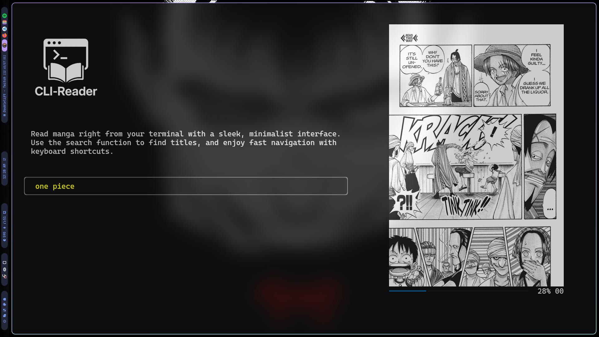
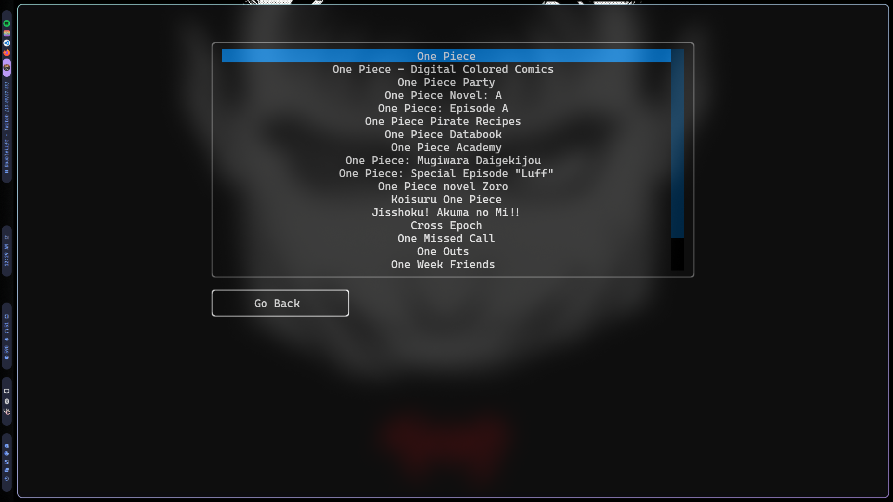
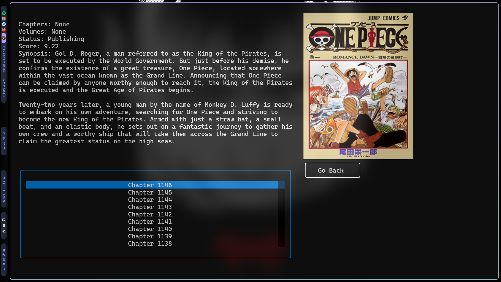

# CLI-Reader

CLI-Reader is a terminal-based manga reader application built with Python. It allows users to browse and read manga chapters directly from the command line.

## Preview

 

 

## Features

- **Manga Navigation**: Browse through manga chapters and pages.
- **Terminal UI**: Built with [Textual](https://github.com/Textualize/textual) for a rich terminal-based user interface.
- **Manga Details API**: Powered by [Jikan API](https://jikan.moe/) to fetch detailed information about manga, including titles, authors, and summaries.
- **Manga Provider**: Uses [MangaPill](https://mangapill.com/) as the primary source for manga chapters and pages.

## Installation

1. Clone the repository:
```bash
   git clone https://github.com/your-username/CLI-Reader.git && cd CLI-Reader
```

2. Run the application:
```python
   python run_app.py
```

3. If you want to get the app showing on Rofi:
```
   Change the directory in the Exec line of the app.desktop file to the correct one where the project is.
   Place the file (app.desktop) isnside the /home/{user_name}/.local/share/applications directory.
```

## Next Updates

Here are the planned updates for CLI-Reader:

- **Download All Chapters**: Add functionality to download all chapters of a manga at once for offline reading.
- **Zoom and Move Images**: Enhance the reading experience by allowing users to zoom in on images and move them around for better readability.
- **Reading Lists**:
  - **Currently Reading**: Track manga that the user is actively reading.
  - **To Read**: Maintain a list of manga that the user plans to read in the future.
  - **Dropped**: Keep track of manga that the user has decided to stop reading.
- **Choose Manga Source**: Add the ability to select the manga provider (e.g., MangaPill or other websites) for scraping manga content.

Stay tuned for these exciting updates!
